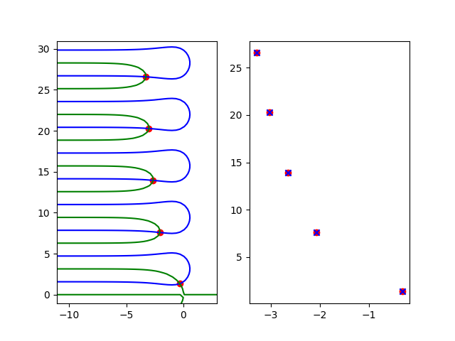

# QPmR Python Package

<p align="center">
    <!-- <a href="https://github.com/LockeErasmus/qpmr/actions">
        
    </a> -->
    <a href="https://pypi.org/project/qpmr/">
        
    </a>
    <!-- <a href="https://qpmr.readthedocs.io/en/latest/?badge=latest">
        
    </a> -->
    <a href="https://github.com/LockeErasmus/qpmr/blob/master/LICENSE">
        
    </a>
</p>

This Python package consists of: 

1. enhanced implementation of *quasi-polynomial based rootfinder*, algorithm for finding roots of given quasi polynomial in given rectangular region in complex plane [[1]](#1), [[2]](#2) enhanced with root-multiplicity heuristic and (in some cases) automatic region selection
1. Spectral distribution properties of quasi-polynomials: (i) delay distribution diagram, (ii) exponential asymptotes of root chains, (iii) safe upper bound of neutral spectrum and (iv) spectrum envelope
1. quasi-polynomial (and transfer function) algebra
1. various functions for quickly visualizing results

For original MATLAB® implementation of old QPmR algorithm from 2012, we refer to [this page](https://control.fs.cvut.cz/en/qpmr/).

<a id="1">[1]</a>
Vyhlidal, T., and Zítek, P. (2009). Mapping based algorithm for large-scale computation of quasi-polynomial zeros. IEEE Transactions on Automatic Control, 54(1), 171-177.

<a id="2">[2]</a>
Vyhlidal, T. and Zitek, P. (2014). QPmR-Quasi-polynomial root-finder: Algorithm update and examples
Editors: Vyhídal T., Lafay J.F., Sipahi R., Sringer 2014.

Please, keep in mind that thisproject is still **under development**.

## Metadata

```
Title: QPmR Python Package
ID: QPmRpythonPackage
Version: 1.0
Project: Robotics and Advanced Industrial Production
Project No.: CZ.02.01.01/00/22_008/0004590
Project RO: 1.1-Optimal control of interconnected time-delay systems
Date: 20.9.2025
Authors: Adam Peichl; Tomas Vyhlidal
Keywords: rootfinding algorithm, exponential polynomial, quasi-polynomial, time delay system, spectrum
```

## Introduction

The `QPmR v2` algorithm is designed to find all roots of the quasi-polynomial

$$h(s) = \sum\limits_{j=0}^{n} p_{j}(s) e^{-s\alpha_j}$$

located in the complex plane region $\mathbb{D} \in \mathbb{C}$, with the 
boundaries $\beta_{min} \leq \Re(\mathbb{D}) \leq \beta_{max}$ and 
$\omega_{min} \leq \Im(\mathbb{D}) \leq \omega_{max}$, where $\alpha_{0}=0 < \alpha_{1} < \dots < \alpha_n$ are the delays and $p_j(s) = \sum\limits_{k=0}^{d}c_{j,k} s^{k}$ where $d = \max\{degree(p_j(s))|j=0,\dots, n\}$.

The following table may clarify quasi-polynomial representation:

```math
\begin{array}{c|cccc|c}
 \alpha_{j} & s^{0} & s^{1} & \dots & s^{d} & p_j(s)e^{-s\alpha_j} \\ \hline
\alpha_{0} & c_{0,0} & c_{0,1} & \dots & c_{0,d} &  \sum\limits_{k=0}^{d}c_{0,k} s^{k} e^{-s\alpha_0} \\
\alpha_{1} & c_{1,0} & c_{1,1} & \dots & c_{1,d} &  \sum\limits_{k=0}^{d}c_{1,k} s^{k} e^{-s\alpha_1} \\
\vdots & \vdots & \vdots & \ddots & \vdots &  \vdots \\
\alpha_{n} & c_{n,0} & c_{n,1} & \dots & c_{n,d} &  \sum\limits_{k=0}^{d}c_{n,k} s^{k} e^{-s\alpha_n}
\end{array}
```

### Examples

This repository contains growing number of [examples](./examples/), we will follow with one from 2014 paper. Please note that `matplotlib` is not required (as `qpmr` is built on `contourpy`, which is dependency of `matplotlib`).

### Example 1

Find all the roots of the quasi-polynomial

$$h(s) = s + e^{-s}$$

located in region $\mathbb{D} = [\beta+j\omega: -10 \leq \beta\leq 2;~0 \leq \omega \leq 30]$.
```math
\begin{array}{c|cc|c}
\alpha_{j} & s^{0} & s^{1} & p_j(s)e^{-s\alpha_j} \\ \hline
0 & 0 & 1 & s \\
1 & 1 & 0 & e^{-s}
\end{array}
```

```python
import logging
import matplotlib.pyplot as plt
import numpy as np
from qpmr import qpmr

delays = np.array([0., 1])
coefs = np.array([[0., 1], [1, 0]])
region = [-10, 2, 0, 30]

roots, meta = qpmr(region, coefs, delays)
matlab_roots = np.array([-0.3181 + 1.3372j,
                         -2.0623 + 7.5886j,
                         -2.6532 +13.9492j,
                         -3.0202 +20.2725j,
                         -3.2878 +26.5805j,])

complex_grid = meta.complex_grid
value = meta.z_value

plt.figure()

plt.subplot(121)
plt.contour(np.real(complex_grid), np.imag(complex_grid), np.real(value), levels=[0], colors='blue')
plt.contour(np.real(complex_grid), np.imag(complex_grid), np.imag(value), levels=[0], colors='green')
plt.scatter(np.real(roots), np.imag(roots), marker="o", color="r")

plt.subplot(122)
plt.scatter(np.real(roots), np.imag(roots), marker="o", color="r")
plt.scatter(np.real(matlab_roots), np.imag(matlab_roots), marker="x", color="b")
plt.show()
```

```
DEBUG:qpmr.qpmr_v2:Grid size not specified, setting as ds=0.36 (solved by heuristic)
DEBUG:qpmr.qpmr_v2:Estimated size of complex grid = 57600.0 bytes
DEBUG:qpmr.numerical_methods:Numerical Newton converged in 3/100 steps, last MAX(|res|) = 9.994753622376123e-09
DEBUG:qpmr.argument_principle:Using argument principle, contour integral = 5.020734859071829
DEBUG:qpmr.argument_principle:Using argument principle, contour integral = 5.020753819340232
```

Resulting in the following figure (left contours and roots, right roots compared with matlab output)


## Logging

`qpmr` package has logger with `NullHandler`, you can for example use

```Python
logger = logging.getLogger("qpmr")
logger.setLevel(logging.DEBUG)
handler = logging.StreamHandler()
formatter = logging.Formatter("%(asctime)s - %(name)s - %(levelname)s - %(message)s")
handler.setFormatter(formatter)
logger.addHandler(handler)
```

## Citing this work

Please, cite the following article
```
@article{vyhlidal2009mapping,
  title={Mapping based algorithm for large-scale computation of quasi-polynomial zeros},
  author={Vyhlidal, Tomas and Z{\'\i}tek, Pavel},
  journal={IEEE Transactions on Automatic Control},
  volume={54},
  number={1},
  pages={171--177},
  year={2009},
  publisher={IEEE}
}
```

Alternatively, this chapter of book
```
@incollection{vyhlidal2014qpmr,
  title={QPmR-Quasi-polynomial root-finder: Algorithm update and examples},
  author={Vyhl{\'\i}dal, Tom{\'a}{\v{s}} and Z{\'\i}tek, Pavel},
  booktitle={Delay Systems: From Theory to Numerics and Applications},
  pages={299--312},
  year={2014},
  publisher={Springer}
}
```

## Installation

### Installing with `pip`

Using pipy (check the version as software is being developed)
```bash
pip install qpmr
```

From github
```bash
pip install qpmr@git+https://github.com/LockeErasmus/qpmr
```

Local install
```bash
pip install <path-to-qpmr>
```

### Installing from source

Clone repository
```bash
git clone https://github.com/LockeErasmus/qpmr.git
```

install from source with `-e`
```bash
pip install -e qpmr
```

## License

This package is available under [GNU GPLv3 license](./LICENSE).
